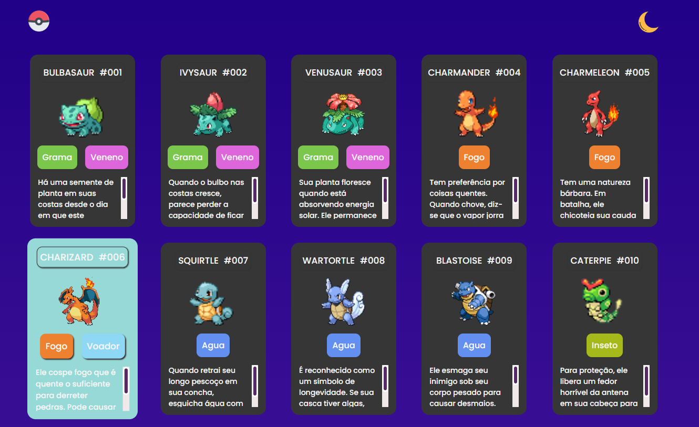
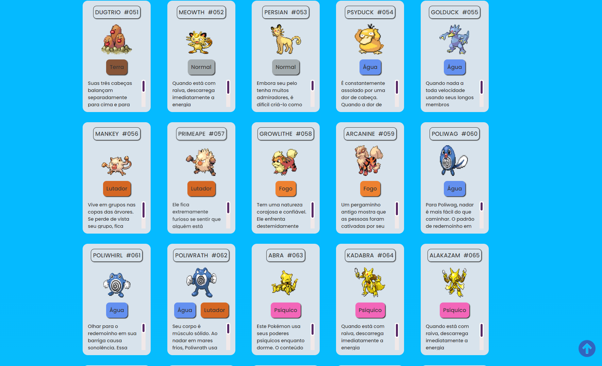
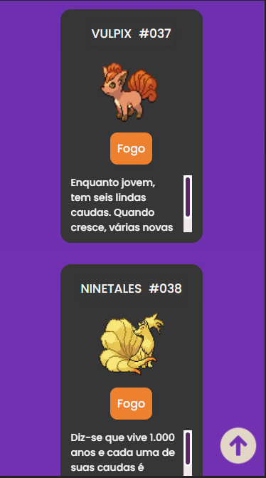

<h1  align="center"><b>Projeto-Listagem-Pokemon</b><h1>
 
<h2>Acesse o Projeto:</h2>
<a align="center" href="https://talyssonamorim.github.io/projeto-listagem-pokemon/" target="_blank"><b><i>Pokedex</b></i></a>
 
 
<h2>Obejtivo: Criar uma pokedex de 1ª Geraçao utilizando:<h2>
<ul>
  <li>HTML</li>
  <li>CSS</li>
</ul>
 
<h2>OBS:</h2>

Utilizei JS apenas para fazer a interação de Modo-Escuro / Modo-Claro

Futuramente pretendo incrementar o JS para consumir a API para Pesquisa e para o Modo brilhante de cada pokemon

 
 

<h1>Modo Escuro</h1>
   

 
 

<h1>Modo Claro</h1>
   

 
 

<h1> Display de Iphone X </h1>
 

 
 
